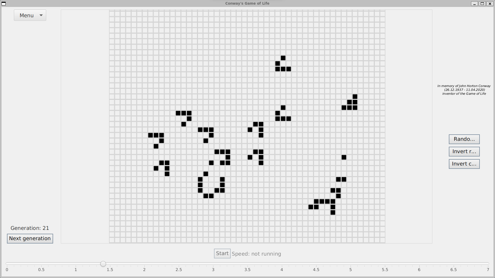

# Conway's Game of Life

Implementation of the famous cellular automaton called Conway's Game of Life in Java.

## Build

First, install Gradle (e.g. the [gradle plugin for VSCode](https://marketplace.visualstudio.com/items?itemName=vscjava.vscode-gradle))

Then execute the Gradle tasks for initializing, building and running the application.

